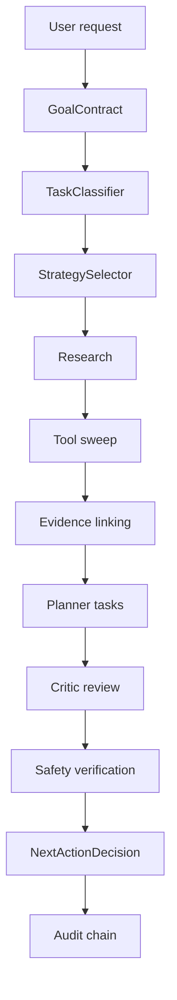

# Architecture — Collatz Atlas + MoO v0

## Purpose

Convert Collatz research intent into **evidence-grounded hypothesis candidates** and **next valid research actions**, using Atlas as the semantic substrate and MoO as the orchestration runtime.

## Planes

### Atlas Data Plane (`atlas/`)

- `ObjectInstance` — typed nodes (Hypothesis, ComputationalResult, …)
- `LinkInstance` — typed edges (supports, blocks, derived_from, …)
- `AtlasStore` — SQLite persistence + graph queries
- `AuditLog` — append-only hash-chained events
- `DomainPack` — YAML ontology loader

Candidate objects remain `lifecycle=candidate` until verification and promotion.

### MoO Control Plane (`moo/`)

- `GoalContractEngine` — structured intent, constraints, acceptance criteria
- `TaskClassifier` — rule-based task class for Collatz goals
- `OrchestratorRegistry` — Planner, Research, Evidence, Tool, Critic, Safety
- `StrategySelector` — fast-path vs sequential vs single
- `MetaOrchestrator` — end-to-end run lifecycle

### Tool Plane (`tools/`)

Bounded Collatz computations invoked only through the Tool orchestrator.

## Hypothesis synthesis flow

## PRD alignment (v0 scope)

| PRD concept | v0 implementation |
| --- | --- |
| Atlas ontology graph | `domains/collatz/` + SQLite store |
| Goal contract | `moo/goal_contract.py` |
| Orchestrator registry | `moo/registry.py` |
| Strategy selection | `moo/strategy_selector.py` |
| Meta-orchestration run | `moo/meta_orchestrator.py` |
| Append-only audit | `atlas/audit.py` |
| JWT / RLS / sandbox | Not in v0 — hooks reserved for upgrade |

## Extension points

- Replace rule-based orchestrators with LLM agents behind the same `BaseOrchestrator.run()` interface
- Add `Pattern` mining in a new orchestrator package
- Wire human approval inbox for counterexample publication boundaries
